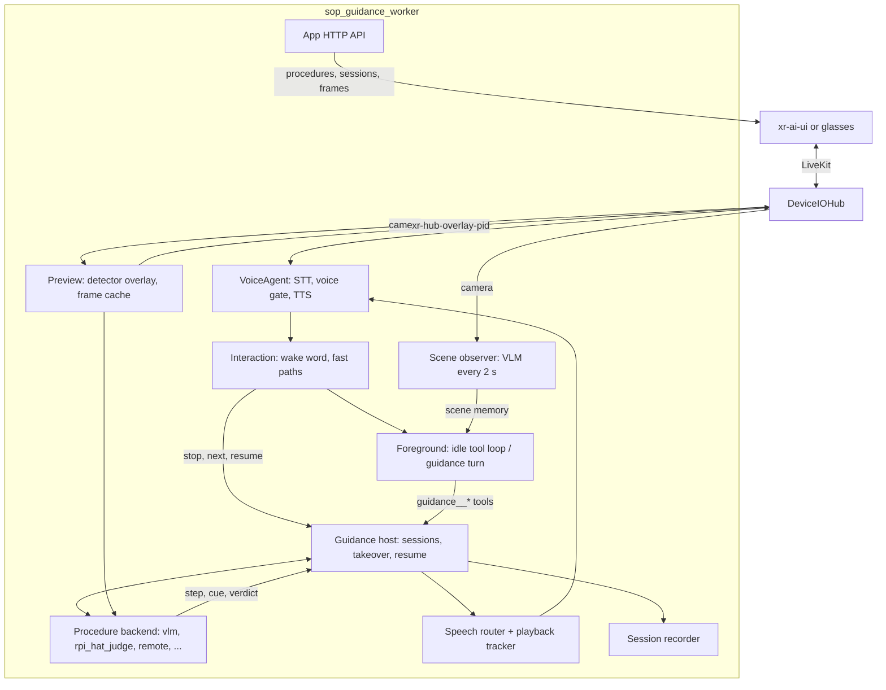
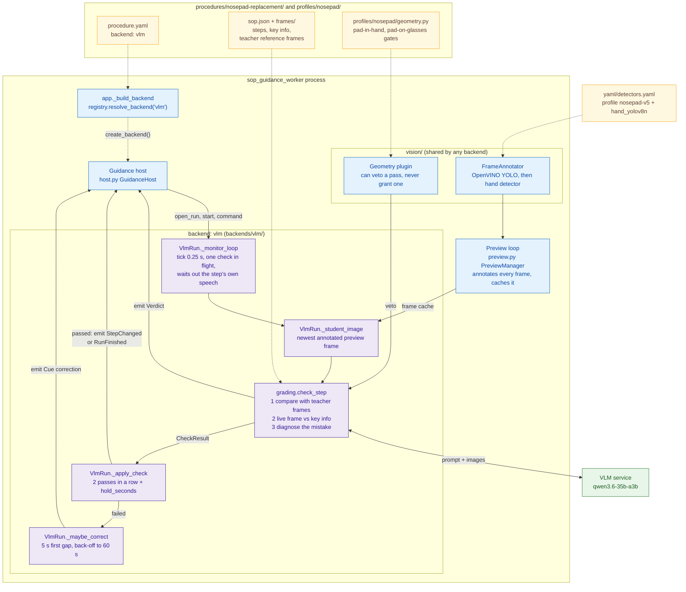
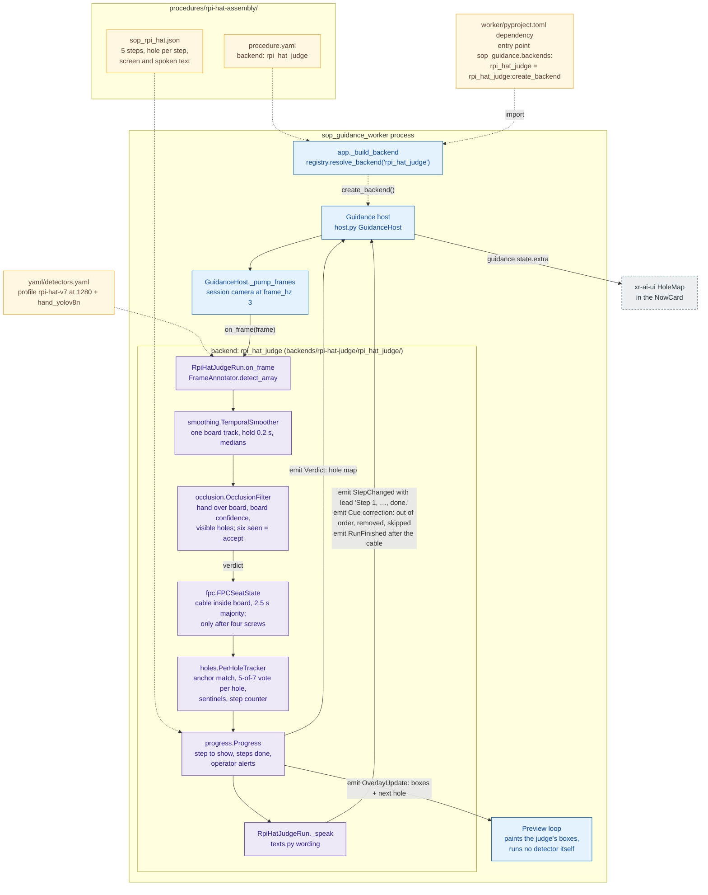
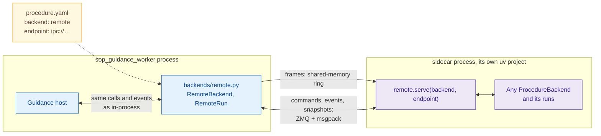
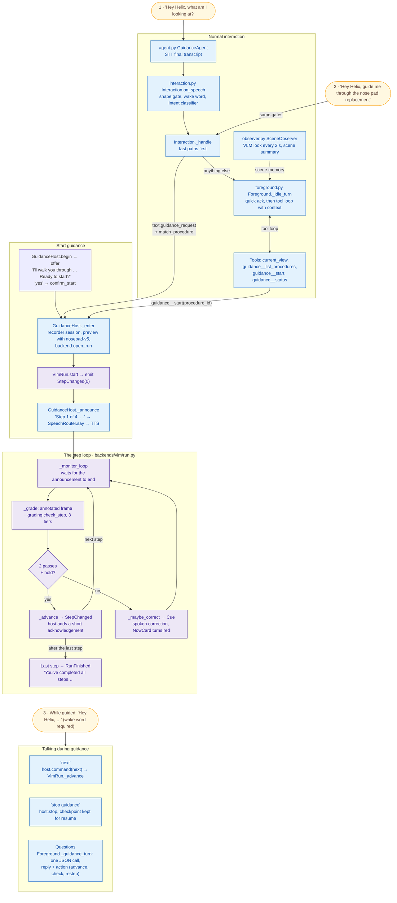
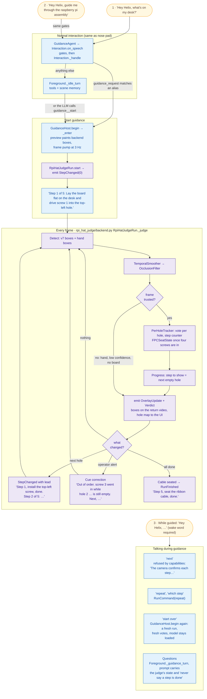

<!--
  SPDX-FileCopyrightText: Copyright (c) 2026 NVIDIA CORPORATION & AFFILIATES. All rights reserved.
  SPDX-License-Identifier: Apache-2.0
-->

# SOP guidance

Spoken, camera-checked guidance through standard operating procedures, for
XR glasses and the xr-ai-ui web client. The wearer says "Hey Helix, guide me
through changing the nose pads", says yes when asked to confirm guided mode,
and the worker announces each step, watches the
input camera, speaks a correction when a step is done wrong, and advances when
the step is visibly complete. Questions asked on the way are answered with a
short reminder of the current step. Two procedures ship:
`nosepad-replacement` (Luma Ultra magnetic nose pads), graded by a
vision-language model, and `rpi-hat-assembly` (Raspberry Pi M.2 HAT+), judged
by a detector and a per-hole state machine.

The orchestrator starts DeviceIOHub, an app-owned DashScope STT/TTS shim and
the guidance worker. Hosted DashScope models do the language and vision work
by default; `yaml/models.local.json` switches to the shared self-hosted stack.

> **Adding a new guidance task?** Start with
> [`docs/adding-a-procedure.md`](docs/adding-a-procedure.md). It covers a
> VLM-graded task that is data only, adding a detector or geometry plugin,
> writing a custom backend, running one as a sidecar, and adding a
> procedure-specific view to xr-ai-ui.

## How it works



- **Tools outside guidance, one JSON turn inside it.** Outside guidance the
  foreground offers `current_view`, `guidance__list_procedures`,
  `guidance__start` and `guidance__status`; the `procedure_id` argument is an
  exact enum of the enabled procedure folders, so the model cannot invent one.
  During guidance each question is one model call that returns a spoken reply
  and an action (none, advance, restep, check, exit, switch, navigate), which
  code applies. Both prompts are the old fork's.
- **Scene memory.** Outside guidance a background observer asks the VLM what
  changed on each watched camera every 2 s and condenses that into a scene
  summary every minute, so the assistant can answer "what did I just do?".
  It pauses while that camera is guided or a turn is in flight (`observer:` in
  the worker yaml; `enabled: false` turns it off).
- **Backends decide completion.** A procedure names a backend. `vlm` grades a
  fresh frame against the step's teacher reference frames (at least two passes
  in a row plus a hold), with an optional detector overlay and a geometry
  plugin that may veto a pass but never grant one. `rpi_hat_judge` is a
  deterministic judge: its own detector, per-hole votes and a step counter
  decide, voice never advances it, and it draws its own boxes on the return
  video. It is a separate package under `backends/`, found through the
  `sop_guidance.backends` entry point, so the worker only lists it as a
  dependency. `remote` runs any backend in a sidecar process.
- **Guidance never talks over itself.** Steps are not graded while their own
  instruction is still playing, corrections back off per step, and late
  results for an older step are dropped.
- **Sessions survive.** Every session is checkpointed under `run/guidance/`.
  "Stop guidance" works without the wake word; "resume" picks up at the saved
  step, also after a worker restart. A second client asking to guide is asked
  to confirm a takeover, and keeps the camera the first session was using.

## Inside each backend

These diagrams zoom into the "Procedure backend" box above. Every backend
sits behind the same seam (`guidance/sop_guidance/backends/base.py`):

- **The host drives the run.** It calls `open_run`, `start`, `on_frame` and
  `command`.
- **The run reports back only through `emit`.** Its events are
  `StepChanged`, `Cue`, `Verdict`, `OverlayUpdate` and `RunFinished`.
- **The host owns everything the wearer sees and hears.** That covers speech,
  `guidance.state`, the return video and the recorder.

Colours:

| Colour | Part |
|---|---|
| Blue | Guidance core |
| Purple | A backend |
| Amber | Procedure data |
| Green | Model services |
| Grey | Outside the worker |

Dashed arrows happen once at startup; solid arrows happen during a run.

### `vlm`: graded by a vision-language model (nose pad)



### `rpi_hat_judge`: judged by a detector and a state machine (Raspberry Pi HAT)

This backend is its own package in `backends/rpi-hat-judge/`. It registers
under the `sop_guidance.backends` entry point, and `worker/pyproject.toml`
lists it as a dependency. The worker imports it and runs it in-process: no
container, no port. It never calls a language model.



### `remote`: any backend in its own process

For a backend whose dependencies cannot share the worker's environment. The
backend itself is unchanged; the host cannot tell the two placements apart.



## One guidance task, end to end

What happens from the first spoken sentence to the last step, with the code
that does each part.

### Nose pad replacement (`vlm`)



### Raspberry Pi HAT assembly (`rpi_hat_judge`)

Normal interaction and the start are the same code as for the nose pad; only
the backend differs. Voice never moves the judge: its capabilities turn off
voice advance, step jumps, on-demand checks and resume.



## Configure

| File | What it holds |
|---|---|
| `yaml/sop_guidance_worker.yaml` | Models file, wake word, foreground, preview, scene observer, voice, app API, recording, and the `guidance_defaults` every procedure inherits |
| `procedures/<id>/procedure.yaml` | One procedure: title, aliases, backend, and overrides of `guidance_defaults` |
| `procedures/<id>/sop.json`, `frames/` | Its steps and teacher reference frames (`vlm` backend) |
| `backends/<name>/` | A procedure backend installed as its own package, such as `rpi-hat-judge` |
| `yaml/detectors.yaml` | Named detector profiles (weights under `detectors/`, in Git LFS) |
| `yaml/models.dashscope.json` | Hosted LLM/VLM and the speech shim on port 8106 (default) |
| `yaml/models.local.json` | The shared self-hosted model servers |
| `yaml/voice_gate.yaml` | Voice gate; wake matching is done by the worker itself |
| `yaml/device_io_hub.yaml` | Room, ports, web client, return video |
| `services/dashscope-speech/dashscope_speech.yaml` | STT/TTS models, voice and context |

Secrets come from the environment only: `DASHSCOPE_API_KEY` for the hosted
models and speech, and optionally `SOP_GUIDANCE_API_TOKEN` to require a bearer
token on the app API.

## Run

From `apps/sop-guidance/`, with hosted DashScope models:

```bash
export DASHSCOPE_API_KEY=...
uv sync
uv run sop_guidance
```

With the self-hosted stack instead, set `models_config: models.local.json` in
the worker yaml, start the shared models and skip the speech shim:

```bash
uv run --project ../../model-server-samples/model-servers model_servers
uv run sop_guidance --no-speech
```

`--capture` also records participant video, audio and data traffic. Open the
web-client URL DeviceIOHub prints, or point xr-ai-ui at the hub, and say
"Hey Helix".

To run the same stack in Docker, see `docker/compose.yaml`:

```bash
cd docker
cp .env.example .env   # set DASHSCOPE_API_KEY
docker compose -f compose.yaml -f compose.cpu.yaml up -d --build
```

Builds run on the host network and use the mirrors set in `docker/.env`
(`APT_MIRROR_HOST`, `PIP_INDEX_URL`, `TORCH_INDEX_URL`; see `.env.example`),
which matter where PyPI and download.pytorch.org are slow. The worker image
bakes in NLTK's `punkt_tab`, which the voice pipeline would otherwise fetch
from GitHub at startup.

## Clients

Clients steer the worker with JSON on named data topics, and the worker
answers on others:

| Topic | Direction | Payload |
|---|---|---|
| `guidance.control` | client → worker | `{"action": "start" \| "stop" \| "resume" \| "confirm" \| "cancel" \| "ready", "procedure_id"?, "session_id"?, "token"?, "request_id"}` |
| `guidance.result` | worker → client | The reply to one control, with its `request_id` |
| `guidance.state` | worker → all | Session id, status, owner, input participant, step, instruction, capabilities |
| `guidance.overlay` | worker → owner | Boxes from a backend that draws its own overlay |
| `xr.main_input` | client → worker | Which participant's camera this client drives |
| `xr.voice_output` | client → worker | `default`, `selected_input` or `web_client` |
| `xr.yolo_mode`, `xr.wake_mode` | client → worker | Live overlay and wake word outside guidance |
| `agent.response`, `chat.user` | worker → all | The transcript |

Untopiced data is typed text and is handled like speech. The app API on
`127.0.0.1:8093` serves `/api/health`, `/api/procedures`, `/api/procedures/{id}`
and its files (reference frames), `/api/sessions` and `/api/live`.

## Test

```bash
uv sync --project worker
worker/.venv/bin/python -m pytest -q
```

## Add a procedure

The step-by-step guide is [`docs/adding-a-procedure.md`](docs/adding-a-procedure.md). It covers a VLM-graded task that is data only, adding a detector or a geometry plugin, writing a custom backend package, running a backend as a sidecar, and adding a procedure-specific view to xr-ai-ui. In short:

A procedure is a folder under `procedures/` with a `procedure.yaml` whose
`id` matches the folder name. For the built-in `vlm` backend, add a schema v1
`sop.json` and the reference frames it names; a detector profile and a
geometry module are optional. No Python is needed:
`tests/fixtures/procedures/filter-swap/` is a complete example. The worker
validates every folder at startup and offers each enabled id to the model as
an exact `procedure_id`.

A procedure that needs its own grader gets a backend package. Implement
`ProcedureBackend` and `ProcedureRun` from `sop_guidance.backends.base`,
register the factory under the `sop_guidance.backends` entry-point group, and
add the package to `worker/pyproject.toml`; the host, tools, speech and UI do
not change. [`backends/rpi-hat-judge`](backends/rpi-hat-judge/README.md) is
the worked example.

A backend that cannot share the worker's environment runs as a sidecar
process instead. Wrap an ordinary backend with
`sop_guidance.backends.remote.serve(backend, endpoint)` in that process, and
point the procedure at it:

```yaml
backend: remote
backend_config:
  endpoint: ipc:///tmp/my-backend.sock
```

Frames reach the sidecar over a shared-memory ring and events come back over
ZMQ. `tests/fixtures/sidecar_stub.py` is a minimal sidecar.

## Evals

`eval/` holds two live-model checks. `eval/eval.py` is a foreground routing
eval driven by `eval/cases.yaml`, in the same style as the tea sample.
`eval/replay.py` re-grades checks recorded by the old glasses worker through
the `vlm` backend and reports agreement and latency against the recorded
verdicts. Pass the recorded session folders on the command line; they are
never read from or written to the repo. Refer to [`eval/README.md`](eval/README.md).
