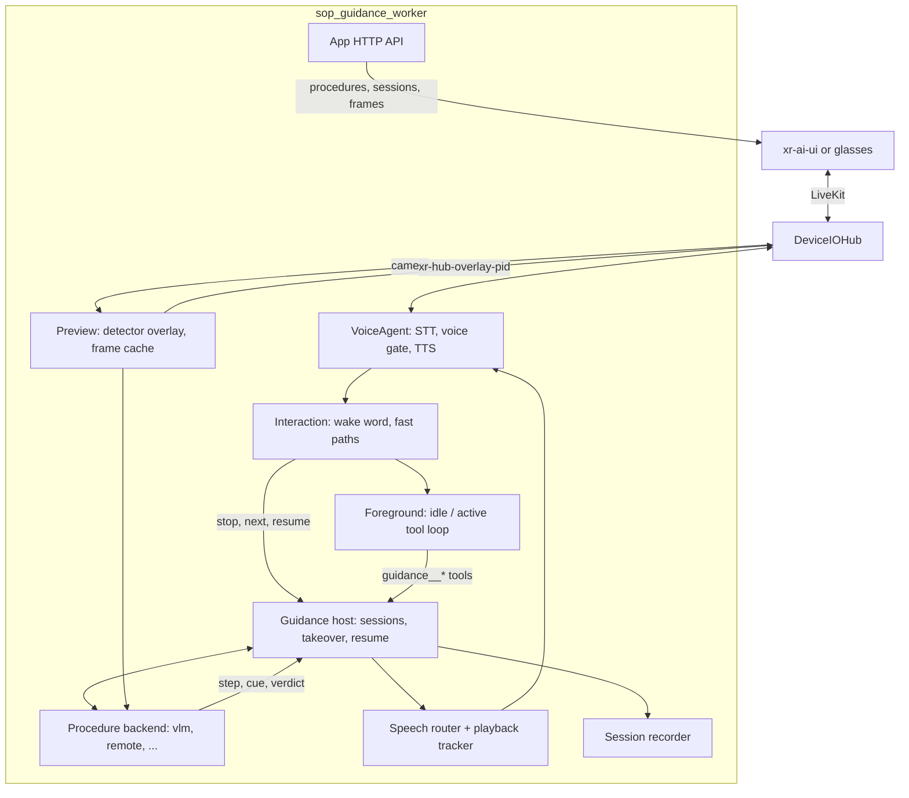

<!--
  SPDX-FileCopyrightText: Copyright (c) 2026 NVIDIA CORPORATION & AFFILIATES. All rights reserved.
  SPDX-License-Identifier: Apache-2.0
-->

# SOP guidance

Spoken, camera-checked guidance through standard operating procedures, for
XR glasses and the xr-ai-ui web client. The wearer says "Hey Helix, guide me
through changing the nose pads"; the worker announces each step, watches the
input camera, speaks a correction when a step is done wrong, and advances when
the step is visibly complete. Questions asked on the way are answered with a
short reminder of the current step. The shipped procedure is
`nosepad-replacement` (Luma Ultra magnetic nose pads).

The orchestrator starts DeviceIOHub, an app-owned DashScope STT/TTS shim and
the guidance worker. Hosted DashScope models do the language and vision work
by default; `yaml/models.local.json` switches to the shared self-hosted stack.

## How it works



- **Tools, not keywords.** Outside guidance the foreground offers
  `guidance__list_procedures`, `guidance__start` and `guidance__status`; the
  `procedure_id` argument is an exact enum of the enabled procedure folders, so
  the model cannot invent one. During guidance it adds stop, advance, repeat,
  check-now and switch.
- **Backends decide completion.** A procedure names a backend. `vlm` grades a
  fresh frame against the step's teacher reference frames (at least two passes
  in a row plus a hold), with an optional detector overlay and a geometry
  plugin that may veto a pass but never grant one. `remote` runs any backend in
  a sidecar process. A custom detector-plus-state-machine judge plugs in as
  another backend without touching the worker.
- **Guidance never talks over itself.** Steps are not graded while their own
  instruction is still playing, corrections back off per step, and late
  results for an older step are dropped.
- **Sessions survive.** Every session is checkpointed under `run/guidance/`.
  "Stop guidance" works without the wake word; "resume" picks up at the saved
  step, also after a worker restart. A second client asking to guide is asked
  to confirm a takeover, and keeps the camera the first session was using.

## Configure

| File | What it holds |
|---|---|
| `yaml/sop_guidance_worker.yaml` | Models file, wake word, foreground, preview, voice, app API, recording, and the `guidance_defaults` every procedure inherits |
| `procedures/<id>/procedure.yaml` | One procedure: title, aliases, backend, and overrides of `guidance_defaults` |
| `procedures/<id>/sop.json`, `frames/` | Its steps and teacher reference frames |
| `yaml/detectors.yaml` | Named detector profiles (weights under `detectors/`, in Git LFS) |
| `yaml/models.dashscope.json` | Hosted LLM/VLM and the speech shim on port 8106 (default) |
| `yaml/models.local.json` | The shared self-hosted model servers |
| `yaml/voice_gate.yaml` | Voice gate; wake matching is done by the worker itself |
| `yaml/device_io_hub.yaml` | Room, ports, web client, return video |
| `services/dashscope-speech/dashscope_speech.yaml` | STT/TTS models, voice and context |

Secrets come from the environment only: `DASHSCOPE_API_KEY` for the hosted
models and speech, and optionally `SOP_GUIDANCE_API_TOKEN` to require a bearer
token on the app API.

## Run

From `apps/sop-guidance/`, with hosted DashScope models:

```bash
export DASHSCOPE_API_KEY=...
uv sync
uv run sop_guidance
```

With the self-hosted stack instead, set `models_config: models.local.json` in
the worker yaml, start the shared models and skip the speech shim:

```bash
uv run --project ../../model-server-samples/model-servers model_servers
uv run sop_guidance --no-speech
```

`--capture` also records participant video, audio and data traffic. Open the
web-client URL DeviceIOHub prints, or point xr-ai-ui at the hub, and say
"Hey Helix".

To run the same stack in Docker, see `docker/compose.yaml`:

```bash
cd docker
cp .env.example .env   # set DASHSCOPE_API_KEY
docker compose -f compose.yaml -f compose.cpu.yaml up -d --build
```

## Clients

Clients steer the worker with JSON on named data topics, and the worker
answers on others:

| Topic | Direction | Payload |
|---|---|---|
| `guidance.control` | client → worker | `{"action": "start" \| "stop" \| "resume" \| "confirm" \| "cancel" \| "ready", "procedure_id"?, "session_id"?, "token"?, "request_id"}` |
| `guidance.result` | worker → client | The reply to one control, with its `request_id` |
| `guidance.state` | worker → all | Session id, status, owner, input participant, step, instruction, capabilities |
| `guidance.overlay` | worker → owner | Boxes from a backend that draws its own overlay |
| `xr.main_input` | client → worker | Which participant's camera this client drives |
| `xr.voice_output` | client → worker | `default`, `selected_input` or `web_client` |
| `xr.yolo_mode`, `xr.wake_mode` | client → worker | Live overlay and wake word outside guidance |
| `agent.response`, `chat.user` | worker → all | The transcript |

Untopiced data is typed text and is handled like speech. The app API on
`127.0.0.1:8093` serves `/api/health`, `/api/procedures`, `/api/procedures/{id}`
and its files (reference frames), `/api/sessions` and `/api/live`.

## Test

```bash
uv sync --project worker
worker/.venv/bin/python -m pytest -q
```

## Add a procedure

A procedure is a folder under `procedures/` with a `procedure.yaml` whose
`id` matches the folder name. For the built-in `vlm` backend, add a schema v1
`sop.json` and the reference frames it names; a detector profile and a
geometry module are optional. No Python is needed:
`tests/fixtures/procedures/filter-swap/` is a complete example. The worker
validates every folder at startup and offers each enabled id to the model as
an exact `procedure_id`.

A backend that cannot share the worker's environment runs as a sidecar
process instead. Wrap an ordinary backend with
`sop_guidance.backends.remote.serve(backend, endpoint)` in that process, and
point the procedure at it:

```yaml
backend: remote
backend_config:
  endpoint: ipc:///tmp/my-backend.sock
```

Frames reach the sidecar over a shared-memory ring and events come back over
ZMQ. `tests/fixtures/sidecar_stub.py` is a minimal sidecar.

## Evals

`eval/` holds two live-model checks. `eval/eval.py` is a foreground routing
eval driven by `eval/cases.yaml`, in the same style as the tea sample.
`eval/replay.py` re-grades checks recorded by the old glasses worker through
the `vlm` backend and reports agreement and latency against the recorded
verdicts. Pass the recorded session folders on the command line; they are
never read from or written to the repo. Refer to [`eval/README.md`](eval/README.md).
